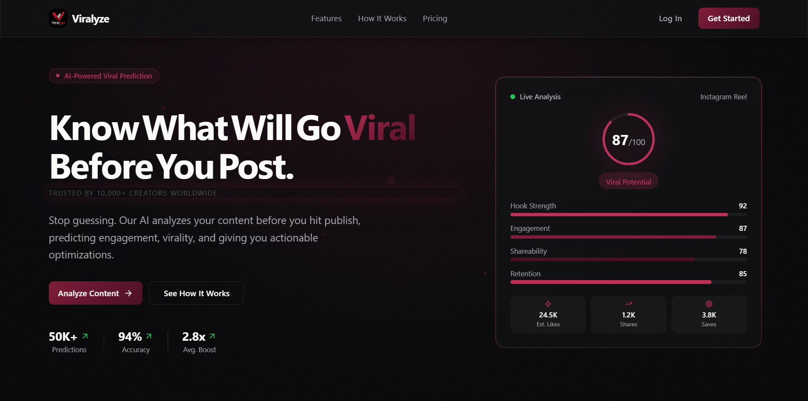
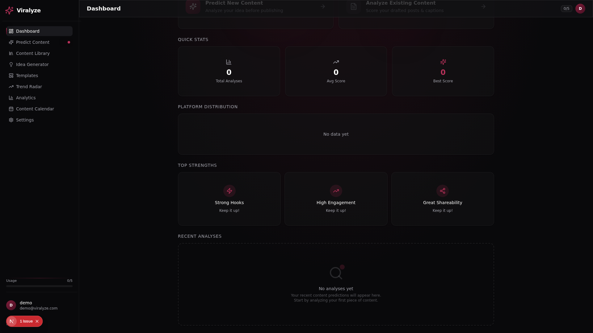
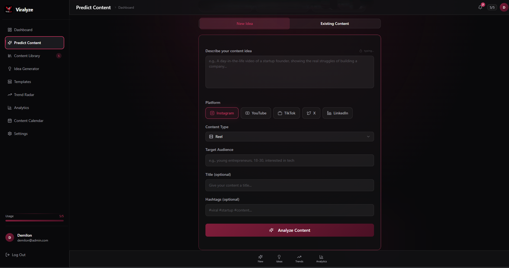
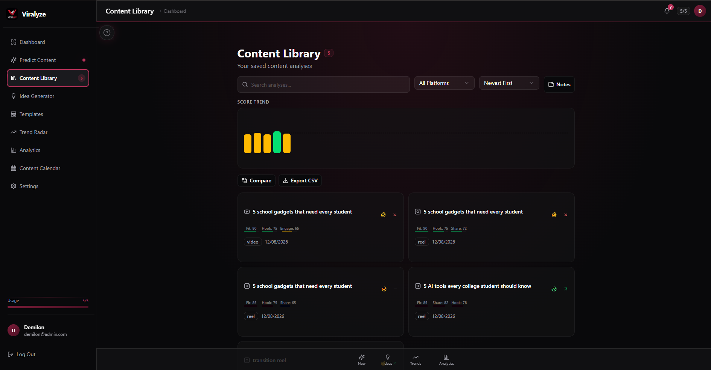
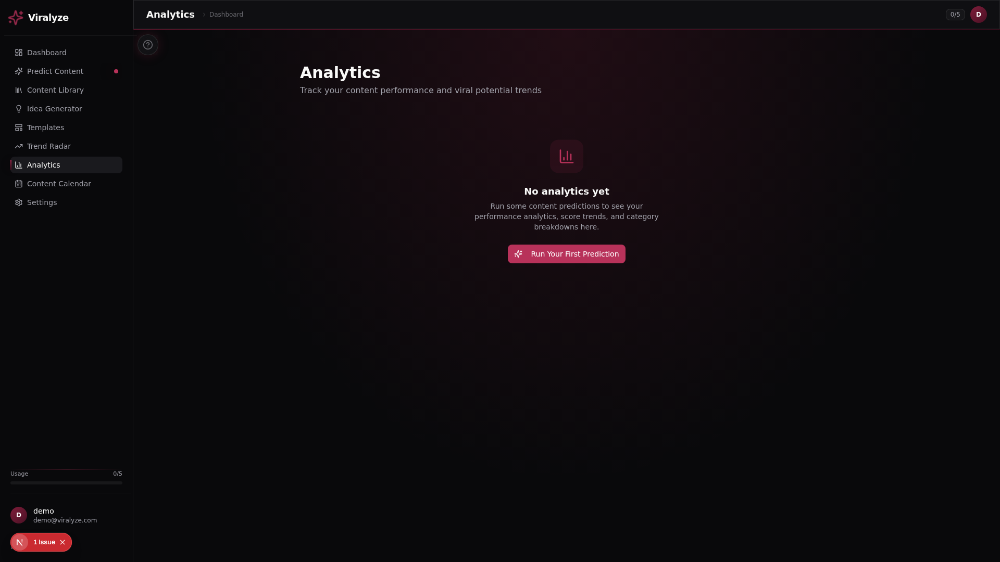
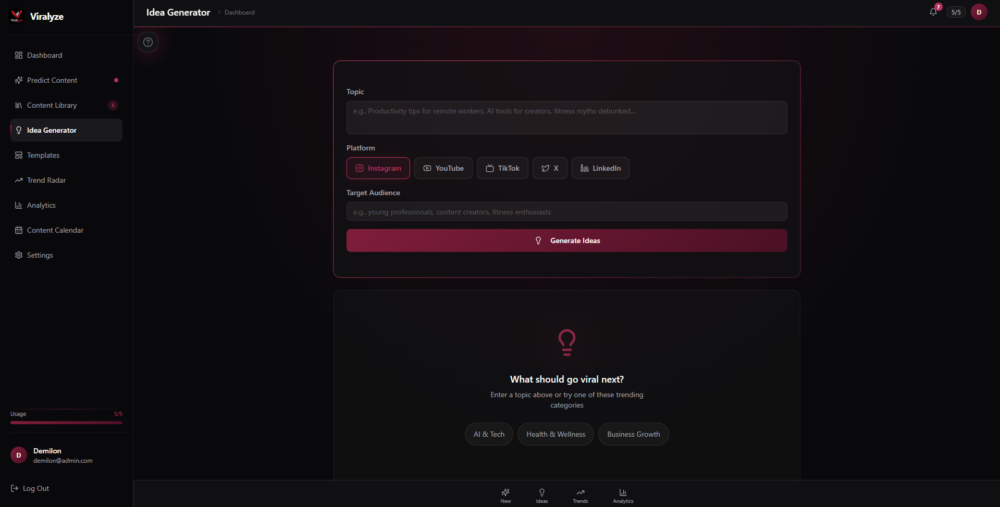

# 🔮 Viralyze — AI-Powered Viral Content Intelligence

<p align="center">
  
</p>

<h2 align="center">
  Don't Guess What Will Go Viral.<br/>
  <strong>Viralyze It.</strong>
</h2>

<p align="center">
  <strong>AI-powered content intelligence for creators, brands, and marketers.</strong>
</p>

<p align="center">
  Predict • Analyze • Optimize • Create • Learn
</p>

<p align="center">
  
  
  
  
  
</p>

---

## 🚀 The Problem

Creating content is easy.

Creating content that **performs** is not.

Creators and marketers often publish content based on intuition:

> "I think this post will perform well."

But by the time the analytics arrive, it is already too late.

Traditional social media analytics primarily tell you:

**What happened?**

Viralyze focuses on a more valuable question:

> **What is likely to happen — and how can we improve the content before publishing?**

---

# 💡 The Solution

## Meet Viralyze

**Viralyze is an AI-powered content intelligence platform designed to help users make smarter content decisions before they hit "Publish."**

Instead of:

```text
Idea
  ↓
Publish
  ↓
Hope
  ↓
Analyze
```

Viralyze enables:

```text
Idea
  ↓
Analyze
  ↓
Predict
  ↓
Optimize
  ↓
Publish
  ↓
Measure
  ↓
Learn
```

The goal is simple:

> ### Turn content creation from guesswork into data-driven decision making.

---

# ✨ Why Viralyze?

Viralyze is more than a dashboard and more than a simple AI content generator.

It connects multiple stages of the content lifecycle into one intelligent workflow.

### 🔮 Predict

Evaluate the potential performance of content before publishing.

### 🧠 Analyze

Understand the factors that can influence content performance.

### ⚡ Optimize

Receive actionable recommendations instead of just a score.

### 💡 Generate Ideas

Turn trends and insights into new content opportunities.

### 📊 Measure

Understand historical performance and identify patterns.

### 📅 Plan

Organize upcoming content with a dedicated content calendar.

### 🔥 Discover Trends

Identify emerging topics and content opportunities.

### 📚 Manage

Keep content organized inside a centralized library.

---

# 🎯 Core Features

| Feature | What It Does |
|---|---|
| 🔮 Viral Prediction | Estimates content performance potential |
| 🧠 AI Analysis | Evaluates content quality and engagement factors |
| ⚡ Quick Score | Quickly evaluate an idea or post |
| ✍️ Optimization | Provides actionable improvement recommendations |
| 💡 AI Ideas | Generates content opportunities |
| 📊 Analytics | Understands content performance |
| 📅 Calendar | Plans and organizes publishing |
| 📚 Library | Stores and manages content |
| 🔥 Trends | Discovers emerging content opportunities |
| 🧩 Templates | Speeds up content creation |
| 🔐 Authentication | Provides secure application access |
| ⚙️ Settings | Personalizes the application experience |

---

# 🖥️ See Viralyze in Action

## 🏠 Landing Page



---

## 📊 Dashboard



---

## 🔮 Content Prediction



---
## 📚 Content Library



---

## 📈 Analytics



---

## 💡 Content Ideas



---

# 🧠 How Viralyze Works

```text
                 ┌─────────────────────┐
                 │     Content Idea    │
                 │   or Existing Post  │
                 └──────────┬──────────┘
                            │
                            ▼
                 ┌─────────────────────┐
                 │    Viralyze AI      │
                 │      Analysis       │
                 └──────────┬──────────┘
                            │
             ┌──────────────┼──────────────┐
             ▼              ▼              ▼
       ┌──────────┐   ┌───────────┐   ┌───────────┐
       │  Score   │   │  Insights │   │ Weaknesses│
       └────┬─────┘   └─────┬─────┘   └─────┬─────┘
            │               │               │
            └───────────────┼───────────────┘
                            ▼
                 ┌─────────────────────┐
                 │    Optimization     │
                 │   Recommendations   │
                 └──────────┬──────────┘
                            │
                            ▼
                 ┌─────────────────────┐
                 │    Better Content   │
                 │    Better Strategy  │
                 └─────────────────────┘
```

---

# 🔄 The Viralyze Content Intelligence Loop

The long-term vision is a continuously improving feedback loop.

```text
       ┌──────────────┐
       │    IDEATE    │
       └──────┬───────┘
              ↓
       ┌──────────────┐
       │   ANALYZE    │
       └──────┬───────┘
              ↓
       ┌──────────────┐
       │   PREDICT    │
       └──────┬───────┘
              ↓
       ┌──────────────┐
       │   OPTIMIZE   │
       └──────┬───────┘
              ↓
       ┌──────────────┐
       │   PUBLISH    │
       └──────┬───────┘
              ↓
       ┌──────────────┐
       │    MEASURE   │
       └──────┬───────┘
              ↓
       ┌──────────────┐
       │    LEARN     │
       └──────┬───────┘
              │
              └───────────────► Better Future Predictions
```

This creates the foundation for a future where every published piece of content can help improve future recommendations.

---

# 🏗️ Architecture

```text
                         ┌─────────────────┐
                         │      USER       │
                         └────────┬────────┘
                                  │
                                  ▼
                     ┌────────────────────────┐
                     │     Next.js Frontend   │
                     │                        │
                     │ Landing • Dashboard    │
                     │ Predict • Analytics    │
                     │ Ideas • Calendar       │
                     │ Library • Trends       │
                     └───────────┬────────────┘
                                 │
                                 ▼
                     ┌────────────────────────┐
                     │       API Routes       │
                     │                        │
                     │ /api/predict           │
                     │ /api/analytics         │
                     │ /api/ideas             │
                     │ /api/trends            │
                     │ /api/calendar          │
                     │ /api/library           │
                     │ /api/settings          │
                     │ /api/auth              │
                     └───────────┬────────────┘
                                 │
                 ┌───────────────┼────────────────┐
                 ▼               ▼                ▼
          ┌────────────┐  ┌────────────┐  ┌────────────┐
          │ AI Engine  │  │ Data Layer │  │    Auth    │
          └──────┬─────┘  └──────┬─────┘  └──────┬─────┘
                 │               │               │
                 └───────────────┼───────────────┘
                                 ▼
                    ┌────────────────────────┐
                    │   Content Intelligence │
                    │     & Recommendations  │
                    └────────────────────────┘
```

---

# 🛠️ Technology Stack

## Frontend

- **Next.js**
- **React**
- **TypeScript**
- **Tailwind CSS**
- **shadcn/ui**
- Responsive UI
- Component-based architecture

## Backend

- **Next.js API Routes**
- Server-side application logic
- REST-style endpoints
- Authentication handling
- Rate limiting

## Data Layer

Viralyze uses an architecture designed to support both local development and production infrastructure.

The application can work with:

- Local development databases
- Environment-based configuration
- Persistent application data
- Production database infrastructure

## AI

Viralyze is designed around AI-assisted workflows for:

- Content scoring
- Content analysis
- Recommendations
- Content ideas
- Optimization
- Platform-specific insights

---

# 📂 Project Structure

```text
Viralyze/
│
├── public/
│   ├── logo.svg
│   ├── viralyze_logo.png
│   ├── favicon.ico
│   └── robots.txt
│
├── src/
│   │
│   ├── app/
│   │   ├── api/
│   │   │   ├── analytics/
│   │   │   ├── auth/
│   │   │   ├── calendar/
│   │   │   ├── ideas/
│   │   │   ├── library/
│   │   │   ├── predict/
│   │   │   ├── settings/
│   │   │   └── trends/
│   │   │
│   │   ├── globals.css
│   │   ├── layout.tsx
│   │   └── page.tsx
│   │
│   ├── components/
│   │   ├── app/
│   │   ├── landing/
│   │   ├── shared/
│   │   └── ui/
│   │
│   ├── hooks/
│   └── lib/
│       ├── rate-limit.ts
│       ├── store.ts
│       ├── types.ts
│       └── utils.ts
│
├── tests/
├── examples/
├── download/
├── package.json
├── package-lock.json
├── next.config.ts
├── tailwind.config.ts
├── tsconfig.json
└── README.md
```

---

# ⚡ Getting Started

## Prerequisites

Make sure you have:

- Node.js 18+
- npm
- Git

---

## 1. Clone the Repository

```bash
git clone https://github.com/YOUR-USERNAME/Viralyze.git
cd Viralyze
```

> Replace `YOUR-USERNAME` with your GitHub username.

---

## 2. Install Dependencies

```bash
npm install
```

---

## 3. Configure Environment Variables

Create a `.env.local` file in the project root.

```env
DATABASE_URL=file:./db/custom.db

GOOGLE_CLIENT_ID=
GOOGLE_CLIENT_SECRET=

NEXT_PUBLIC_SUPABASE_URL=
NEXT_PUBLIC_SUPABASE_ANON_KEY=
SUPABASE_SERVICE_ROLE_KEY=
```

Add any additional AI/API credentials required by your deployment.

### ⚠️ Important

Never commit secrets to GitHub.

Do not expose:

```text
.env
.env.local
API keys
OAuth secrets
Database credentials
Service role keys
```

---

## 4. Run the Development Server

```bash
npm run dev
```

Open:

```text
http://localhost:3000
```

---

# 🧪 Development Commands

### Start development server

```bash
npm run dev
```

### Run lint

```bash
npm run lint
```

### Create production build

```bash
npm run build
```

### Start production server

```bash
npm start
```

---

# 🔐 Security

Viralyze follows an environment-based configuration model.

Sensitive credentials should never be hardcoded into the source code.

Examples include:

- API keys
- OAuth credentials
- Database credentials
- AI provider credentials
- Supabase service-role keys

Environment variables should be configured separately for development and production.

---

# 🎯 Target Users

### 👤 Content Creators

Make smarter content decisions without relying entirely on guesswork.

### 📱 Social Media Managers

Evaluate, optimize, and organize content more efficiently.

### 🚀 Startups & Brands

Build a more data-driven content strategy.

### 📣 Marketing Teams

Bring ideation, analysis, planning, and performance intelligence together.

### 🎥 Influencers

Understand what can make content more engaging for their audience.

---

# 🏆 What Makes Viralyze Hackathon-Worthy?

Viralyze is not just another content generator.

It focuses on the **decision-making layer before publishing**.

Many existing workflows look like:

```text
Create
   ↓
Publish
   ↓
Wait
   ↓
Analyze
```

Viralyze changes the workflow to:

```text
Create
   ↓
Predict
   ↓
Analyze
   ↓
Optimize
   ↓
Publish
   ↓
Measure
   ↓
Learn
```

The core innovation is moving content intelligence **upstream**.

Instead of only telling creators:

> "Your content received 12,000 views."

Viralyze aims to help answer:

> **"Why might this content work, what could make it stronger, and what should I change before publishing?"**

---

# 🌎 Vision

## From Content Analytics → Content Intelligence

The future of content creation shouldn't simply be:

```text
Create → Publish → Measure
```

It should be:

```text
Understand
    ↓
Predict
    ↓
Optimize
    ↓
Create
    ↓
Publish
    ↓
Learn
```

Viralyze is being built toward that future.

---

# 📈 Roadmap

## Phase 1 — Foundation

- [x] Landing page
- [x] Dashboard
- [x] Content prediction
- [x] Content analysis
- [x] Ideas
- [x] Analytics
- [x] Calendar
- [x] Library
- [x] Trends
- [x] Templates
- [x] Authentication architecture
- [x] Responsive application UI

## Phase 2 — Intelligence

- [ ] Personalized prediction models
- [ ] Historical performance learning
- [ ] Platform-specific scoring
- [ ] Audience-specific predictions
- [ ] Advanced recommendation engine
- [ ] Trend-to-content generation

## Phase 3 — Automation

- [ ] Social media platform integrations
- [ ] Automated content scheduling
- [ ] Performance monitoring
- [ ] Automatic post optimization
- [ ] Real-time trend detection

## Phase 4 — Predictive Intelligence

```text
Your Content
     ↓
Historical Data
     +
Audience Signals
     +
Platform Signals
     +
Trend Signals
     ↓
Personalized Prediction
     ↓
Recommended Optimization
     ↓
Publish
     ↓
Real Performance
     ↓
System Learns
     ↓
Better Future Predictions
```

---

# 🚀 Future Potential

Viralyze can evolve into a complete content intelligence ecosystem.

Potential future capabilities include:

- Personalized creator models
- Cross-platform performance prediction
- Real-time trend intelligence
- Audience behavior modeling
- Automated content optimization
- AI-powered publishing strategies
- Performance forecasting
- Creator-specific recommendations
- Brand content intelligence
- Automated experimentation and A/B testing

The ultimate goal is to create a system where **content performance data continuously improves future decisions**.

---

# 🤝 Contributing

Contributions, ideas, bug reports, and improvements are welcome.

### Create a feature branch

```bash
git checkout -b feature/your-feature
```

### Make your changes

```bash
git add .
```

### Commit

```bash
git commit -m "feat: add your feature"
```

### Push

```bash
git push origin feature/your-feature
```

Then open a Pull Request.

---

# 📄 License

This project is licensed under the MIT License.

---

# 💜 Built With Passion

Viralyze was built around one simple belief:

> ## Great content shouldn't be a guessing game.

Creators shouldn't have to publish first and understand later.

They should be able to **predict, understand, improve, and create with confidence.**

---

<h2 align="center">
  🔮 Viralyze
</h2>

<p align="center">
  <strong>Predict. Optimize. Go Viral.</strong>
</p>

<p align="center">
  Built for innovation. Designed for creators. Powered by AI.
</p>

<p align="center">
  ⭐ If you find Viralyze interesting, consider starring the repository!
</p>